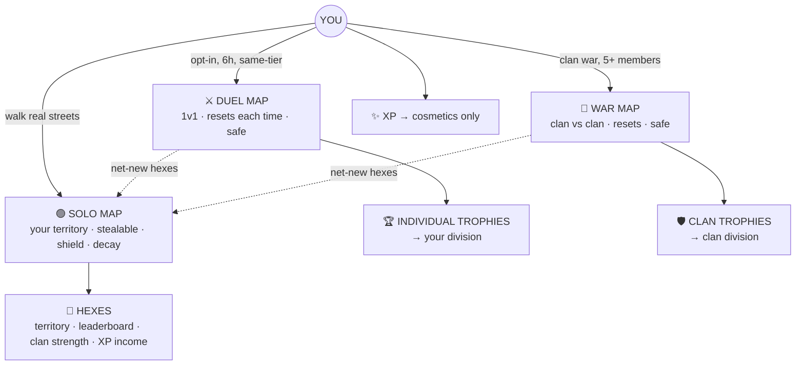

# 🌍 MyLoop — Game Design (Living Doc)

> Walk the real world, capture hexagon territory, rise solo and with your clan.
> _Working mode: **local only — not pushed.** Status: ✅ locked · 🔵 open · ⏳ deferred._

---

## 🗺️ The world in one picture

**Three maps, three rewards.** Your Solo map is the only place hexes are real and stealable. Duels and Wars are temporary scoreboards on the same streets — safe, reset every time — and anything genuinely new you grab there flows back into Solo.

---

## 📖 How it all fits — Maya's story

**Day 1 — First steps (Stockholm).** Maya installs, picks an avatar + color, sets her home. A guided walk turns her first hexes green in real time; she curves back to her start and the whole block fills at once.
▸ _She now has **Hexes** (her territory), earned **XP**, and sits in the **Bronze** division._

**Day 2 — The world bites back.** A daily mission and her new streak pull her out again. While she's at work, a neighbor walks her block and steals 5 hexes — but her **shield** caps the bleed and buys her recovery time. That evening a push warns some hexes are about to **decay**; she re-walks to refresh them.
▸ _Solo map = **open + shield + decay**. Territory must be defended and maintained._

**Day 4 — Her first Duel.** Maya opts into a **Duel**: matched with a same-tier player, 6 hours, a **fresh map that starts at zero**. She doesn't grind — she plans one efficient **loop** (big interior for few steps), detours for a **5× bonus hex**, and watches her rival's **live bar** creep up. She wins by 12.
▸ _**+Individual Trophies** → climbing toward Silver. The brand-new land she grabbed is added to her **Solo** map (with decay). Her duel score didn't touch her account hex total — only the net-new did._

**Week 2 — She joins a clan.** Maya joins a clan (max **50** members) as a **Scout**. Her hex count now adds to **clan strength**. She chats with members to plan walks.
▸ _Solo hexes now do double duty: personal territory **and** clan power._

**Week 3 — Clan war.** The clan has 5+ members, so the **Captain** declares a **War** — same rules as a duel, but clan vs clan. Every member walks and collects on the reset war map (independent capture — no one blocks anyone). The clan out-collects the rival and wins.
▸ _**+Clan Trophies** → clan division rises. Maya personally banked **XP + net-new hexes**, but her **individual** trophies were untouched — wars and duels are separate ladders._

**Month 2 — Two ladders, climbing apart.** Maya is promoted to **Ranger** (she can invite now). She grinds duels to **Gold** individually, while the clan climbs its **own** division through wars. A weak dueler in her clan is still a war hero — different strengths, different ladders.

---

## 🧱 Reference

### 💠 The three things you earn
| Thing | Its one job | Earned from |
|---|---|---|
| **Hexes** (account) | Territory → map, leaderboard, clan strength, XP income | Solo collect; net-new in duels/wars |
| **Individual Trophies** | Your division + duel matchmaking | Duels: win **+**, lose **−** |
| **XP / Level** | Cosmetics only (never power) | All activity |

### 🗺️ The three maps
| Map | Stealable? | Shield? | Decay? | Persists? |
|---|---|---|---|---|
| 🟢 **Solo** | Yes (neighbors) | **Yes** | Yes | Yes — real territory |
| ⚔️ **Duel** | No | No | Resets each duel | Only **net-new** → Solo |
| 🏴 **War** | No | No | Resets each war | Only **net-new** → Solo |

_Net-new = a hex **that player** never owned before._

### 🎮 Modes → what they affect
| Mode | How it works | Affects |
|---|---|---|
| **Solo collect** | Walk real world; take neutral/decayed land; keep it (only decay removes it) | +Hexes, +XP, exploration, missions, streak |
| **Duel** | Opt-in, same-tier, 6h, fresh 0-start map; independent capture; live opponent bar | ±Individual Trophies → division, +XP, +net-new Hexes |
| **War** | Clan vs clan, needs **5+** members; otherwise = team duel | ±Clan Trophies → clan division, +XP & +net-new Hexes per member |

### 🧠 Strategy levers (duels **and** wars)
| Lever | Decision it adds | Built? |
|---|---|---|
| **Loops score big** | Plan a smart loop (interior fill) > raw steps | ✅ exists |
| **Bonus hexes (5×)** | Detour for the gold hex, or sweep cheap ones? | new, easy |
| **Best-of-3 objectives** | most hexes / biggest loop / most net-new → comebacks | ⏳ defer past v1 |

### 👥 Clans
- **Max 50 members.** War needs **≥5**. Chat = **clan-only** (trash-talk to opponents → v2).
- **Clan strength = Σ members' current hex count** → drives the clan leaderboard.
- **Roles** (Scout → Ranger → Captain → Sovereign):

| Role | Can do |
|---|---|
| 👑 **Sovereign** (leader) | Everything; promote/demote anyone; transfer leadership; disband |
| ⭐ **Captain** (co-leader) | Declare & manage wars; kick and promote up to Ranger |
| 🎖️ **Ranger** (elder) | Invite players; accept join requests |
| 🚶 **Scout** (member) | Walk, contribute hexes, chat |

### 🪜 Two separate ladders
| | **Individual** | **Clan** |
|---|---|---|
| Fueled by | Duels (win/lose) | Wars (win/lose) |
| Currency | Individual Trophies | Clan Trophies |
| Ladder | Your division (Bronze→Diamond) | Clan division |
| Matchmaking | Same individual tier | Same clan division |

---

## 🔢 Numbers — v1 starting values (designed to tune with live data)

### 🛡️ Solo defense
| Param | Value | Why |
|---|---|---|
| Per-hex cooldown | **1h** | was 0.0167 (test bug) — stops ping-pong |
| Steal cap per window (X) | **clamp(20% of your hexes, min 5, max 50)** | can't be wiped |
| Shield duration | **(stolen ÷ X) × 16h**, min **4h** | adaptive to damage |
| Shield trigger | when X hit, or 1h after first steal | |
| Shield burn (you capture while shielded) | **−20 min per hex** captured | attacking ends protection |
| Starter shield | first **3 days** or until **50 hexes** | newbie ramp |
| Decay | 7d local … 90d far (unchanged) | the solo antagonist |

### 🏆 Trophy ladder → divisions (replaces hex-based tiers)
| Tier | Trophy floor | | Per duel |
|---|---|---|---|
| Bronze | 0 | | Win **+30** |
| Silver | 400 | | Lose **−15** |
| Gold | 1,000 | | Floor-protected: can't drop below current tier |
| Platinum | 1,800 | | Matchmaking: within **±150 trophies** (~same tier) |
| Crystal | 2,800 | | First **3 duels** = placement/calibration |
| Diamond | 4,000+ | | Each tier splits into 4 divisions (I–IV) |

### ✨ XP & Levels
| Param | Value |
|---|---|
| Curve (keep) | `Level = 1 + √(XP/100)` |
| Sources (keep) | capture +10 · steal +25 · walk +50/km · streak +20/day · all-missions +100 · achievements +25–1000 |
| **XP income** | walk XP × `(1 + min(0.5, hexes/10000))` — more territory = faster XP **when active** |
| Pace | ~600 XP/active day → L10 ≈ 2 wks, L20 ≈ 2 mo, L50 ≈ 1 yr |

### 🎨 Cosmetic unlocks (by level + duel/war drops)
| Level | Unlock |
|---|---|
| 1 | Base hex skin + trail |
| 3 | Hex skin #2 |
| **5** | **Clan creation** (anti-spam gate) + first trail FX |
| 8 | Claim animation FX |
| 10 | Profile frame |
| 15 | Map theme |
| 20 | Premium hex skin |
| — | Seasonal cosmetics from duel/war wins (keeps max-level players earning) |

### ⚔️ Duel / War params
| Param | Duel | War |
|---|---|---|
| Window | 6h | 24h |
| Frequency | 3/day | clan-scheduled |
| Members | 1v1 | 5–50 per clan |
| Bonus hexes | 3–5 @ 5× | 3–5 @ 5× |
| Matchmaking | same individual division | same clan division |

### ⚙️ Code constants to change (`GameConstants.cs`)
`CellCooldownHours 0.0167 → 1.0` · retire hex-based `HexTier` as division source → trophy ladder · **add:** `ShieldMaxHours=16, ShieldFloorHours=4, StealCapPct=0.2 (min5/max50), StarterShieldDays=3, ShieldBurnMinPerHex=20, TrophyWin=30, TrophyLoss=15, XpIncomeCapPct=0.5` + division floors · fix seed users to new ladder.

---

## 📌 Status
| Entry | State |
|---|---|
| 01 Player progression spine | ✅ locked |
| 02 Clans | ✅ locked |
| 03 Territory wars | ✅ locked (v1 = sum of effort; contiguity → v2) |
| 04 XP cosmetics | ✅ locked |
| 05 Numbers | ✅ v1 starting values (tune with telemetry) |

## 🚀 Launch
**Single city: Stockholm.** Every multiplayer system (duels, wars, clans, stealing, leaderboards) needs local density; scattered global = empty map. Note: Turf (Sweden) proves the appetite and is the direct competitor.

## ▶️ Next
Design is complete enough to build v1. Implement on the feature branch, instrument telemetry, and rebalance the Entry-05 numbers from real Stockholm play.
