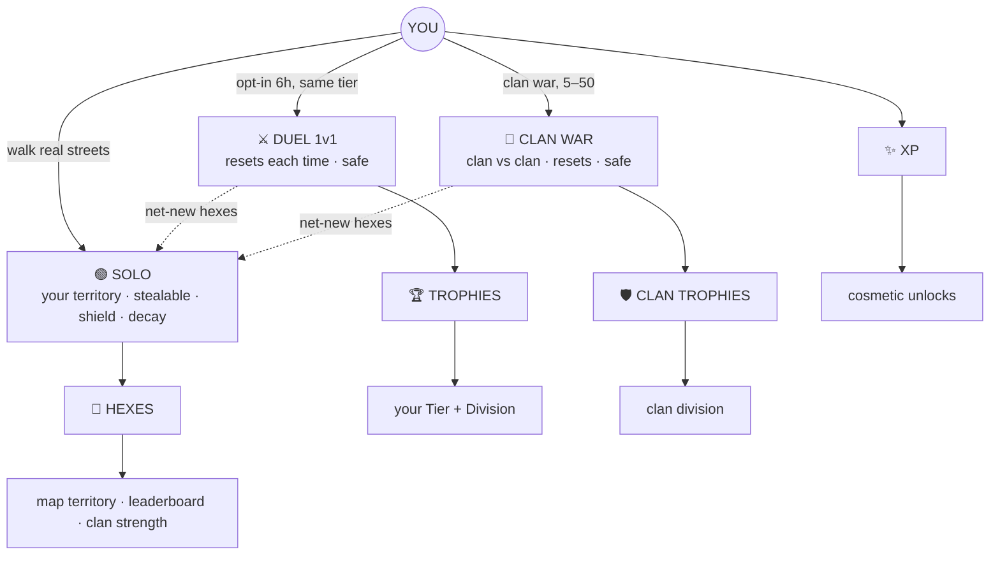
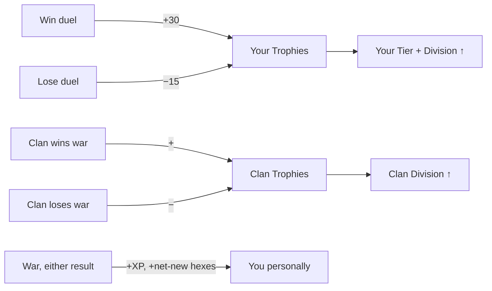

# 🌍 MyLoop — Game Design Foundation

> **Walk the real world. Capture hexagon territory. Rise solo, and conquer with your clan.**
> This doc is the single source of truth — readable as a story for customers, precise enough to build from.
> _Mode: local only, not pushed. Status: ✅ locked · 🔵 open._

---

## 📌 Part 0 — Strategy & the "Why" (living log — nothing final unless ✅)

> How we decide direction: what we chose, what we rejected, **why** — grounded in why other apps failed.

**🧭 North star (proposed):** **"Claim your city."** A hyper-local, competitive, crew-based land-grab — your real neighbourhood is the board; your conquered map is your flag.

**Identity (leaning):** competitive **game** first; **fitness = free outcome** we advertise but never design around (Pokémon GO trojan-horse model). "Serve both audiences" rejected as *positioning* → product becomes mush, unmarketable in one line.

**Emotional core (proposed):** hexes ≠ Pokémon (no borrowed love), so we **manufacture** emotion from 3 feelings needing no IP:
1. **"My streets"** — ownership of real places (territorial instinct, older than any IP).
2. **"Someone near me wants them"** — local rivalry = built-in word-of-mouth.
3. **"Look at my map"** — your colour spreading across the real world = the shareable flex (Strava-heatmap effect).

### 📉 Why others failed — what we copy / avoid
| App | Got right | Why it failed / stayed small | Our move |
|---|---|---|---|
| Pokémon GO | IP emotion, social, simple verb | rural dead zones; needs IP + huge content | density-first; manufacture emotion (no IP) |
| Ingress | deep, devoted core | complex, hardcore-only, no acquisition hook | dead-simple onboarding |
| **Turf** | our exact mechanic, fanatics | no emotional wrapper / acquisition → tiny for 10 yrs | identity + rivalry + word-of-mouth |
| **StepN** (move-to-earn) | explosive growth | crypto ROI loop → bots/mercenaries → ponzi collapse | **never tie play to per-action money** |
| Strava | identity + heatmap flex + social | premium fatigue; not a game | steal the heatmap flex, skip the paywall core |
| Pikmin Bloom | cozy, broad reach | shallow, low stakes, forgettable | stakes + rivalry drive retention |
| Zombies, Run! | loyal narrative niche | solo, narrow, no competition | social + competition over solo story |

### 🎯 Why our gamble is *better* (not safer — better)
- **Blue ocean:** all walking energy is cozy/wellness; nobody owns competitive-local-tribal walking.
- **We design around the exact killers others ignored:** density (city-first), cold-start (ghost duels), hardcore-lapping (tiers/shields/divisions), the money trap (no tokens).
- **Emotion is manufactured, not borrowed** → repeatable in any city, unlike Pokémon's IP dependence.
- **Asymmetric bet:** ~$0 to test one city · bounded downside · whole-category upside · founder-market fit.

### 🔴 The real bet = density, not features
Mechanics are done; life/death is **manufacturing a dense pocket** — rivalry, clans, and the emotion itself only switch on with people nearby. Plan: seed **one tight community** (campus / run club / Discord / one Stockholm district) so density is instant on day one.

### 💸 Money & prizes (decision)
- ❌ **Move-to-earn / per-action value** (money or tokens per hex) — banned. The StepN trap: farmers/bots → ponzi → collapse.
- ✅ **Finite, sponsored event prizes** (e.g. a Stockholm shoe shop sponsors "King of the City") — allowed as an **acquisition tactic**. _Gated:_ (1) real anti-cheat first (a real prize = a real spoof incentive), (2) reward more than just #1 (raffle above a threshold / per-division / most-improved) so casuals keep hope.
- **The line:** "win occasional prizes" ✅ vs "earn value every step" ❌.

### 🔵 Open
First 50 players + which dense pocket · anti-cheat hardening before any real-prize contest · final emotional-core wording.

---

## 🗺️ The world in one picture

---

## 📖 Maya's story (how every piece connects)

**Day 1 — First territory.** Maya installs in Stockholm, picks an avatar + colour, sets her home. A guided walk turns hexes green in real time; she loops back to her start and the whole block fills.
▸ _She owns **Hexes**, earned **XP**, sits at **Bronze I**. A **starter shield** protects her for her first days._

**Day 2 — Defend & maintain.** A neighbour walks her block and steals a few hexes — her **shield** caps the loss and gives recovery time. A push warns hexes will **decay** tonight; she re-walks to refresh.
▸ _Solo = **open world + shield + decay**. Territory is held, not just collected._

**Day 4 — First Duel.** She opts into a **Duel**: matched with a same-**Tier** player, 6 hours, a **fresh map starting at zero**. She plans an efficient **loop**, grabs a **5× bonus hex**, and watches her rival's **live bar** climb. Wins by 12.
▸ _**+30 Trophies** → climbing toward Silver. The brand-new land she grabbed flows into her **Solo** map. Her hex *total* only grew from the net-new — re-walking her own land just scored duel points._

**Week 2 — A clan.** She joins a clan (max **50**) as a **Scout**. Her hexes now add to **clan strength**.
▸ _Her territory does double duty: personal + clan power._

**Week 3 — Clan War.** With 5+ members, the **Captain** declares **War** (24h). Everyone walks and collects on the reset war map. The clan out-collects the rival.
▸ _**+Clan Trophies** → clan division rises. Maya personally banked **XP + net-new hexes** — but her **individual Trophies were untouched.**_

**Month 2 — Two ladders.** Promoted to **Ranger** (can invite). She climbs duels to **Gold**; the clan climbs its **own** division through wars. A weak dueller can still be a war hero.

---

## 💰 The three things you earn — and what each is FOR

| | 💎 **Hexes** | 🏆 **Trophies** | ✨ **XP** |
|---|---|---|---|
| **What it is** | Land you hold right now | Your skill rating | Lifetime progress |
| **Earn by** | Solo collecting; net-new in duels/wars | Duels: win **+30**, lose **−15** | Every action (capture, walk, steal, missions, streak) |
| **Can it drop?** | Yes — stolen (shield protects) + decay | Yes — lose a duel (tier-floor protected) | No — only rises |
| **What it drives** | Map territory · **Leaderboard** · **Clan strength** | Your **Tier + Division** (Bronze→Diamond, I–IV) · duel matchmaking | **Levels → cosmetic unlocks** (+ clan-create gate) |
| **What it helps you achieve** | Be #1 by territory; power your clan | Prove you're the best player; climb leagues | Personalize your look; flex status |

_(Clans have a parallel **Clan Trophies → Clan Division** ladder, fed by wars.)_

### 🎖️ What climbing Tiers & Divisions gives you
- **v1:** status everywhere (profile, leaderboard, clan roster) **+ a tier-exclusive cosmetic** each new tier (Gold skin, Diamond trail) — wearable status, no power.
- **v2:** **Seasons** — monthly soft-reset + exclusive seasonal cosmetics by peak tier (the CoC/Apex recurring chase).
- _Hexes rank you by **territory** (leaderboard); Trophies rank you by **duel skill** (Tier). Two identities, both "winning."_

---

## 🎮 Solo vs Duel vs Clan War — side by side

| | 🟢 **Solo (you)** | ⚔️ **Duel (1v1)** | 🏴 **Clan War (team)** |
|---|---|---|---|
| **What you do** | Walk, claim neutral/decayed land, defend yours | Opt-in 6h race vs a same-Tier player | Team (5–50) races a rival clan, 24h |
| **The map** | Persistent real world | Fresh 0-start overlay | Fresh 0-start overlay |
| **Stealable?** | Yes (shield protects) | No | No |
| **You earn** | Hexes, XP, missions, streak | ±Trophies, XP, net-new hexes | +XP, net-new hexes |
| **Affects YOU** | Hexes → leaderboard, clan strength | **Trophies → your Tier/Division** | XP + hexes only — **your Tier untouched** |
| **Affects CLAN** | Your hexes = clan strength | — | **Clan Trophies → clan division** |
| **Win condition** | (ongoing) | Higher score in 6h | Clan with higher total |

---

## 🔁 How wins & losses ripple

**Key rule:** duels are *your* ladder; wars are the *clan's* ladder. Helping your clan win a war never moves your personal Tier — but it grows your hexes, your XP, and your clan's standing.

---

## 🧠 How to win — strategy (duels **and** wars)

| Lever | The decision it creates | Built? |
|---|---|---|
| **Loops score big** | Close a loop → capture the whole interior. Smart routing beats raw steps. | ✅ exists |
| **Bonus hexes (5×)** | 3–5 high-value hexes appear; detour for them or sweep cheap land? | new |
| **Live opponent bar** | You see them gaining → push harder, time your final loop | new |
| **Best-of-3 objectives** | most hexes / biggest loop / most net-new → comeback paths | 🔵 v2 |
| **Clan coordination** | (wars) members link territory for a bonus | 🔵 v2 (needs density) |

---

## 👥 Clans

- **Max 50 members.** War needs **≥5**. Chat = **clan-only** (trash-talk to rivals → v2).
- **Clan strength = Σ members' current hex count** → clan leaderboard.
- **Clan discovery:** browse/search clans (sorted by division, activity, proximity) + request to join — so new players actually find a clan.
- High clan division → **cosmetic clan badge + bragging rights** (v1); perks (bigger cap, etc.) → v2.
- **Roles** (Scout → Ranger → Captain → Sovereign):

| Role | Can do |
|---|---|
| 👑 **Sovereign** (leader) | Everything; promote/demote anyone; transfer leadership; disband |
| ⭐ **Captain** (co-leader) | Declare & manage wars; kick and promote up to Ranger |
| 🎖️ **Ranger** (elder) | Invite players; accept join requests |
| 🚶 **Scout** (member) | Walk, contribute hexes, chat |

---

## 🔢 Numbers — v1 starting values (tune with live data)

**🛡️ Solo defense** — per-hex cooldown **6h** · steal cap per window **clamp(20% of holdings, 5–50)** · shield **(stolen÷X)×16h, min 4h** · shield burns **−20 min per hex you capture while shielded** · **starter shield 3 days / until 50 hexes** · decay 7d local→90d far.

**🏆 Trophy → Tier** — Bronze 0 · Silver 400 · Gold 1,000 · Platinum 1,800 · Crystal 2,800 · Diamond 4,000 (each = 4 divisions). Duel **win +30 / lose −15**, tier-floor protected. Matchmaking ±150 trophies. First 3 duels = placement.

**✨ XP & Levels** — `Level = 1 + √(XP/100)`. Capture +10 · steal +25 · walk +50/km · streak +20/day · all-missions +100 · achievements +25–1000. _(XP from actions only — no idle/territory income.)_

**🎨 Cosmetic unlocks** — L1 base skin+trail · L3 skin#2 · **L5 clan creation** + trail FX · L8 claim FX · L10 profile frame · L15 map theme · L20 premium skin · + seasonal drops from duel/war wins.

**⚔️ Duel / War** — Duel: **queue & search → push when matched → both get 6h**; **ghost-duel fallback** (race a same-tier player's recorded run) if no match in ~2 min. 3/day, same-division. War 24h, 5–50, same clan division. Bonus hexes 3–5 @ 5×.

**⚙️ Code constants (`GameConstants.cs`)** — `CellCooldownHours 0.0167→6.0` · rename/retire `HexTier` → trophy-driven `Tier` · add `ShieldMaxHours=16, ShieldFloorHours=4, StealCapPct=0.2(min5/max50), StarterShieldDays=3, ShieldBurnMinPerHex=20, TrophyWin=30, TrophyLoss=15` + division floors · fix seed users.

---

## 📌 Status & Launch
01 Progression ✅ · 02 Clans ✅ · 03 Wars ✅ · 04 Cosmetics ✅ · 05 Numbers ✅ (tune live).
**Launch single-city: Stockholm** — all multiplayer needs local density; scattered = empty map. (Turf = proven appetite + competitor.)

---

## ✅ Decisions locked this round
- Duel matching = **queue & search → push when matched → both 6h**, with **ghost-duel fallback** (recorded same-tier run) so duels always fire at launch.
- **Tier rewards** = status + tier-exclusive cosmetics (v1); **Seasons** (v2).
- **Clan division** = cosmetic clan badge + bragging (v1); perks (v2). **Clan discovery browser** added.
- `HexTier` → **Tier** (trophy-driven). **XP-income removed.**

## 🔵 Known issue to tune (not a blocker)
- **Duel fairness vs geography:** matched by skill, but a walking race also favours dense areas + free time. Loops + bonus hexes give an efficiency path. v1: accept; if telemetry shows geography dominating, switch duel scoring to **hexes-per-km**.

## ⏳ v2 backlog
Seasons · clan missions (keep clans alive between wars) · best-of-3 duel objectives · clan contiguity bonus · trash-talk chat · clan perks.
