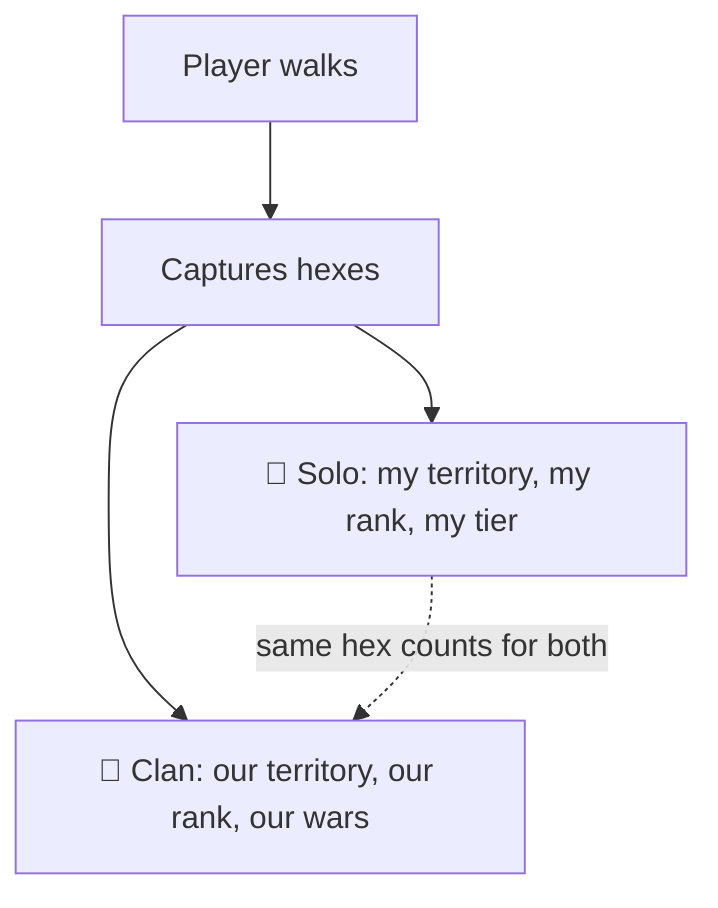
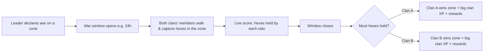
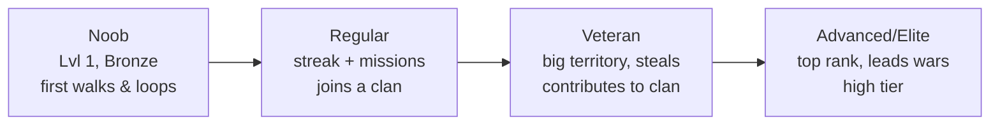
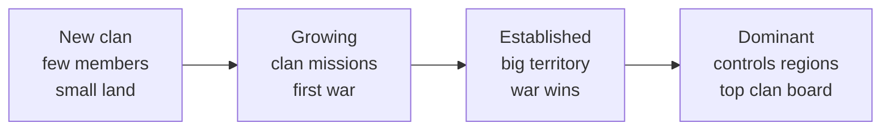

# MyLoop — Feature Roadmap (V1 → V3)

**What MyLoop is:** a walking game. You walk in the real world, the hexagons you pass through become your territory. Play **solo** to build your own empire, or join a **clan** to conquer land as a team.

This doc is **feature-only**: what each feature is, how it works, who it's for, and when it ships.

**Legend** — Who it's for: 🧍 Individual · 👥 Clan (team) · 🔀 Overlapping (both).
Build: ✅ built · 🟡 partly built · 🔴 new.

---

## 1. The two ways to play

A captured hex is **always yours personally** — and if you're in a clan, it **also** counts toward the clan. One walk, two kinds of progress.

---

## 2. Feature map — individual / team / overlapping

| Feature | 🧍/👥/🔀 | One-line |
|---|:--:|---|
| Real-time capture (the walk) | 🔀 | Walk → hexes turn yours live |
| Close-the-loop area capture | 🔀 | Close a loop → grab everything inside |
| Visible map | 🔀 | See neutral, your, rival & enemy-clan land |
| Personal territory & decay | 🧍 | Your hexes fade if you don't re-walk |
| Steal & defend | 🔀 | Walk through a rival hex to take it; cooldown protects fresh claims |
| Streaks | 🧍 | Daily walking streak (with grace day) |
| Daily missions | 🧍 | 3 small goals/day |
| Achievements | 🧍 | Long-term milestones |
| Player XP / level / tier | 🧍 | Personal progression |
| Player leaderboard | 🧍 | Rank vs nearby players |
| **Clan** (create/join) | 👥 | Team you belong to |
| **Clan chat** | 👥 | Talk & coordinate |
| **Clan territory** | 👥 | Land your members hold together |
| **Clan XP / level / tier** | 👥 | Team progression |
| **Clan leaderboard** | 👥 | Clan vs clan |
| **Clan missions** | 👥 | Shared team goals |
| **Territory wars** | 👥 | Two clans fight over a zone, winner takes it |
| Notifications | 🔀 | Personal + clan events |

---

## 3. How each feature works

### 3a. Individual & overlapping features

| Feature | What it is | How it works | Build |
|---|---|---|---|
| **The Walk** 🔀 | Capture hexes by walking | Tap Start → walk → each hex you enter turns yours live → tap Finish for a summary. Works offline (syncs later). | 🟡 |
| **Close the Loop** 🔀 | Area capture | Walk back near your start → the whole enclosed area fills with your color at once. | ✅ |
| **Visible map** 🔀 | The game board | Full map always visible. Color-coded: ⬜ neutral (grab it), 🟩 yours, 🟥 rival player, 🟦 your clan, 🟧 enemy clan. | 🟡 |
| **Decay** 🧍 | Land needs upkeep | Your hexes slowly fade; re-walk to refresh. Fully faded = released. Push reminder before they expire. | ✅ |
| **Steal & defend** 🔀 | Take rival land | Walk through a rival's hex = it's yours. Freshly claimed hexes get a cooldown shield so they can't be instantly re-taken. | ✅ |
| **Streaks** 🧍 | Daily habit | Walk on consecutive days → streak grows. One grace day absorbs a miss. | ✅ |
| **Daily missions** 🧍 | Bite-size goals | 3 goals/day (capture X, walk Y, etc.) + bonus for all 3. | ✅ |
| **Achievements** 🧍 | Milestones | Unlock badges for lifetime stats (distance, captures, streak…). | ✅ |
| **Player leaderboard** 🧍 | Personal rank | Ranked vs nearby players; always shows a meaningful standing. | ✅ |

### 3b. Clan (team) features

| Feature | What it is | How it works | Build |
|---|---|---|---|
| **Clan** 👥 | Your team | Create or join a clan. Roles: **Leader · Officer · Member**. Leader/officers invite, kick, declare wars. | 🔴 |
| **Clan chat** 👥 | Team comms | In-app chat for the clan; coordinate walks & wars. | 🔴 |
| **Clan territory** 👥 | Shared land | Every hex a member holds counts as clan land. Shown as one color on the map. Clan area = sum of members' territory. | 🔴 |
| **Clan missions** 👥 | Shared goals | Weekly team objectives ("clan captures 1,000 hexes") → clan XP + rewards. | 🔴 |
| **Clan leaderboard** 👥 | Clan vs clan | Clans ranked by clan XP / territory / wars won. | 🔴 |
| **Territory wars** 👥 | Team battle | See below. | 🔴 |

### 3c. Territory wars (V1) — how a war works

- A **zone** = a defined map region. A leader/officer declares war (or accepts a challenge).
- During the window, members of both clans race to **capture and hold** hexes in that zone.
- The clan **holding the most hexes** when time runs out **wins** the zone, plus a clan-XP payout and bragging rights.
- Individual captures during a war **also** earn the member their normal personal XP.

---

## 4. Stats we track

### 4a. Per **player** (most already built)
| Stat | Meaning | Built |
|---|---|---|
| Hex count | Hexes you currently own | ✅ |
| Total captured | Lifetime hexes captured | ✅ |
| Total stolen | Hexes taken from others | ✅ |
| Distance walked | Lifetime km | ✅ |
| Streak / max streak | Current & best daily streak | ✅ |
| XP / Level / Tier | Personal progression | ✅ |
| Achievements | Unlocked count | ✅ |
| Rank | Position on leaderboard | ✅ |
| **Clan contribution** | Hexes/XP you added to your clan | 🔴 |

### 4b. Per **clan** (new)
| Stat | Meaning | Built |
|---|---|---|
| Members | Count + roster | 🔴 |
| Clan territory | Total hexes/area held by members | 🔴 |
| Clan XP / Level / Tier | Team progression | 🔴 |
| Wars won / lost | War record | 🔴 |
| Clan rank | Position vs other clans | 🔴 |
| Weekly activity | Members' km + captures this week | 🔴 |
| Founded / Leader | Identity | 🔴 |

---

## 5. How XP works

### 5a. Player XP — what earns it (values from current code)
| Action | XP |
|---|---|
| Capture a hex | +10 |
| Steal a hex | +25 |
| Walk 1 km | +50 |
| Active streak (per day) | +20 |
| Complete a mission | varies |
| Complete all 3 daily missions | +100 |
| Unlock an achievement | varies |

**Level** rises as total XP grows (each level needs more than the last). Level + hex count set your **Tier badge**.

### 5b. Clan XP — what earns it (new design)
| Action | Clan XP |
|---|---|
| Any member captures a hex | small share to clan |
| Member steals from an **enemy clan** | bonus |
| Win a **territory war** | large |
| Complete a **clan mission** | medium |

**Clan Level / Tier** rises with clan XP — unlocks more members, more simultaneous wars, clan perks.

---

## 6. Progression: noob → advanced

### Player journey

### Clan journey

*(Tier names are placeholders — Player: Bronze→…→Elite · Clan: Squad→Crew→Faction→Empire. Final names TBD.)*

---

## 7. What players need to **share** (collaboration)

| Shared thing | Who shares it | Why |
|---|---|---|
| Clan territory | All members | One pooled map presence |
| Clan chat | All members | Coordinate walks & wars |
| Clan XP / Level | All members | Everyone's captures level up the clan |
| Clan missions | All members | Team goal, split the work |
| Territory wars | All members | Win by capturing together in the zone |

---

## 8. Version rollout

| Feature | V1 | V2 | V3 |
|---|:--:|:--:|:--:|
| Real-time capture, loops, visible map | ● | | |
| Personal territory, decay, steal/defend | ● | | |
| Streaks, missions, achievements, player XP/tiers | ● | | |
| Player leaderboard (local) | ● | | |
| **Clans: create/join, roles, chat** | ● | | |
| **Clan territory + clan XP/level** | ● | | |
| **Territory wars** | ● | | |
| Clan missions | | ● | |
| Clan leaderboard (clan vs clan) | | ● | |
| Rivalries / revenge, player profiles | | ● | |
| Country leaderboard, shareable cards, weekly recap | | ● | |
| Seasons / resets | | | ● |
| Alliances (clans team up), prestige/mastery | | | ● |
| Friends / social graph | | | ● |

> **Co-founder note (honest):** clans + territory wars are *multiplayer* features — they shine when players are nearby and fade in an empty city. So V1 **keeps the full solo set** (capture, decay, streaks, missions, tiers) so a lone player still has a complete game, while clans/wars switch on the moment a second player shows up. That's how we win both the empty city and the packed one.

---

*Build-state tags reflect the current codebase. Items marked 🔴 are the new work for V1 clans + wars.*
