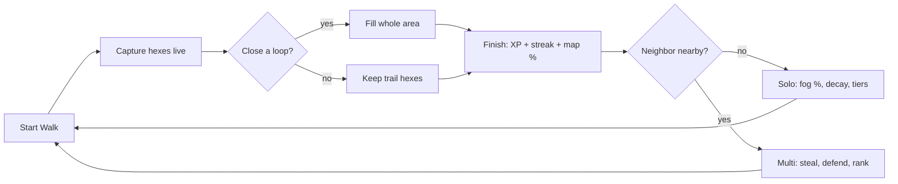
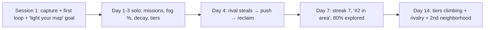
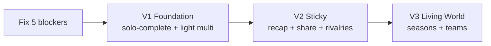

# MyLoop — Roadmap & Product Plan (V1→V3)

Single source of truth. **Rule:** every version hooks the **solo** player (empty city) *and* the **multiplayer** player (dense city).
Build-state tags reflect a real scan of `/api` and `/mobile`. ✅ built · 🟡 data exists, UX missing · ⚠️ launch-blocker · 🔴 new.

---

## 1. Version overview

| | **V1 — Foundation** | **V2 — Sticky & Shareable** | **V3 — Living World** |
|---|---|---|---|
| **Goal** | Fun solo, multiplayer-ready | Retention + organic growth | Density-driven depth |
| **Solo hook** | Explore + fight decay | Weekly recap + routes | Seasons + mastery |
| **Multi hook** | Steal/defend + local board | Rivalries + country board | Teams + territory wars |
| **Headline** | Light up your map (fog-of-war) | Shareable loop cards | Seasons |

---

## 2. Core loop (V1)



---

## 3. Feature → Version → Mistake solved

| Feature | Solo/Multi | Ver | Mistake it kills | Who made it |
|---|:--:|:--:|---|---|
| Real-time capture (active walk) | Both | V1 | Battery murder; 24/7 tracking creep | All GPS games |
| Close-the-loop area capture | Both | V1 | No "wow"; trail-only is flat | Strava |
| **Fog-of-war exploration %** | Solo | V1 | **Dead zones / needs density** | Pokémon GO, Ingress |
| Territory decay | Solo | V1 | "Claimed all → done" plateau | Collection games |
| Streaks + grace day | Solo | V1 | Streak anxiety → churn | Duolingo |
| Daily missions (solo-completable) | Solo | V1 | Goals needing other players | Turf |
| Achievements / XP / tiers | Solo | V1 | Pay-to-win progression | Many F2P |
| Steal & defend (real cooldown) | Multi | V1 | Territory flips = chaos / needs density | Turf, Ingress |
| **Local leaderboard first** | Multi | V1 | Empty global board demotivates | Pre-density games |
| Solo + multi notifications | Both | V1 | Spam / solo player never pinged | Most apps |
| Teach-by-doing onboarding | Both | V1 | Tutorial never teaches core loop | Most games |
| Licensed map tiles | Infra | V1 | ToS break / cost blowup | (tile scraping) |
| Weekly recap | Solo | V2 | No weekly reason to return | — |
| Shareable loop card | Growth | V2 | No organic acquisition loop | — |
| Suggested routes | Solo | V2 | "Where do I even walk?" friction | Niantic |
| Rivalries / revenge | Multi | V2 | No recurring opponent = no grudge | — |
| Country leaderboard | Multi | V2 | Scales competition post-density | — |
| Seasons / resets | Both | V3 | Veterans lock out newcomers | Ingress, MMOs |
| Teams / alliances | Multi | V3 | No cooperation hook | — |
| Territory wars | Multi | V3 | No high-status set pieces | — |
| Prestige / mastery | Solo | V3 | No end-game for grinders | — |

---

## 4. V1 features — how they work

| Feature | How it works | Alone → Dense | Build |
|---|---|---|---|
| **The Walk** | Tap Start → walk → hexes turn yours live → Finish summary | Free land → contested | 🟡 (bg unbuilt) |
| **Close the Loop** | Curve back to start → whole enclosed area fills | Solo land-grab → swallow rival cluster | ✅ |
| **Fog-of-war** | Map starts dark; walking reveals it permanently; complete neighborhoods | **Main goal** → side goal | 🟡 |
| **Decay** | Owned hexes fade over days; re-walk to refresh; push before expiry | Your antagonist → rivals grab fading land | ✅ / 🟡 push |
| **Streaks** | Daily walk = streak; 1 grace day absorbs a miss | Pure solo | ✅ / 🔴 grace |
| **Missions** | 3 solo-completable goals/day + all-3 bonus | Pure solo | ✅ (dup bug) |
| **XP/tiers** | Walking earns XP→levels→tier badge; achievements | Pure solo status | ✅ |
| **Steal/defend** | Walk through rival hex = steal; cooldown shields fresh claims | Silent → core conflict | ✅ (config) |
| **Local board** | Rank vs nearby players; "#1 in your area" even at low density | Self/area → real ladder | ✅ |
| **Notifications** | Solo: decay/explore. Multi: stolen/rank-drop | Solo still pinged | ✅ / 🟡 |
| **Onboarding** | Guided real first walk + first loop, not a slideshow | Same | 🟡 |

---

## 4b. V2 features — how they work

| Feature | How it works | Alone → Dense | Build |
|---|---|---|---|
| **Weekly recap** | Sunday summary: km walked, hexes, new areas, tier progress | Solo ritual → + social comparison | 🔴 (from existing data) |
| **Shareable loop card** | Export an image of your loop + captured area to share | Brag solo → flex a rival win | 🔴 |
| **Fog-of-war (full mode)** | Promote exploration from card to a first-class map mode | Headline solo goal | 🟡 |
| **Suggested routes** | "1.2 km loop near you captures ~25 hexes" | Removes "where do I walk?" | 🔴 |
| **Rivalries / revenge** | "PlayerX took 12 hexes from you this week" → reclaim list | n/a → recurring grudge loop | 🟡 (`CellTransfer` exists) |
| **Country leaderboard** | Expand scope beyond local once density supports it | n/a → wider ladder | ✅ |
| **Player profiles** | View another player's stats/territory/tier | n/a → social proof | 🟡 |
| **"Near your turf" alert** | Push when a rival is active by your land | n/a → defend-now urgency | 🔴 |
| **Anti-cheat hardening** | Tighten spoof detection before competition scales | Both | ✅ → harden |

---

## 4c. V3 features — how they work

| Feature | How it works | Alone → Dense | Build |
|---|---|---|---|
| **Seasons / resets** | Periodic territory reset; fresh goals + season rewards | Fresh solo goals → everyone re-competes | 🔴 |
| **Teams / alliances** | Join a neighborhood team; pooled territory | n/a → cooperation hook | 🔴 |
| **Territory wars** | Timed events to contest a zone together | n/a → high-status set piece | 🔴 |
| **Prestige / mastery** | Post-max-tier mastery tracks for grinders | Solo end-game | 🔴 |
| **Personal challenges/quests** | Renewable solo objectives ("explore 5 areas this week") | Solo content tap | 🔴 |
| **Friends / light social** | Follow players, compare, light social graph | n/a → relationship retention | 🔴 |

---

## 5. Genre mistakes we design against

| # | Mistake | Antidote |
|---|---|---|
| M1 | Dead zones (nothing where you live) | Fog-of-war + decay + tiers (zero players needed) |
| M2 | Requires density to be fun | Graceful density degradation (§7) |
| M3 | Battery murder | Capture only during explicit walk; tuned GPS |
| M4 | Onboarding never teaches the loop | First session = real capture + real loop |
| M5 | Streak anxiety → churn | Grace day / freeze |
| M6 | Empty leaderboard demotivates | Local scope; always a meaningful standing |
| M7 | Pay-to-win | Progression earned only by walking |
| M8 | Spoofing ruins competition | Local boards + server anti-cheat |
| M9 | Annoying/empty notifications | Every alert earned + personal |
| M10 | Fake players | Never fake presence; seeded land labeled neutral |
| M11 | Progress lost on bad network | Offline write-ahead-log (already built) |
| M12 | Safety/liability ignored | Safety nudges + clear terms |

---

## 6. Player journey (V1)



Hooked solo first (M1/M2 killed); multiplayer arrives **additively**, never required.

---

## 7. Density behavior

| Feature | Alone | Dense |
|---|---|---|
| Map | Canvas, fog reveals | Live battlefield |
| Capture | Free land | Contested land |
| Decay | Your antagonist | Rivals grab fading land first |
| Leaderboard | "#1 in area" / vs past-you | Real ladder |
| Steal/defend | Silent (no fakes) | Core conflict |
| Explore % | Main goal | Side goal |

> Hard rule: **never fake players.** Neutral seeded land = ok; fake live rivals = no.

---

## 8. Build state & launch-blockers

```mermaid
flowchart TD
    subgraph Built ✅
      X1[Loop capture] --- X2[Decay+cleanup]
      X3[Missions/XP/achievements/streaks] --- X4[Steal/leaderboard/SignalR/FCM]
      X5[Offline claim queue]
    end
    subgraph UX missing 🟡
      Y1[Fog-of-war] --- Y2[Decay push] --- Y3[Onboarding tutorial]
    end
    subgraph Blockers ⚠️
      Z1[Background capture unbuilt] --- Z2[Cooldown=1min]
      Z3[Dup missions: no constraint] --- Z4[SignalR authz leak] --- Z5[Keyless tiles]
    end
```

| ⚠️ Blocker | Where | Fix |
|---|---|---|
| Background capture unbuilt | `location_service.dart:69`; no Android loc perms/service | Foreground-service model, or honest foreground-only |
| Cooldown = 1 min "test" | `GameConstants.cs:21` | Real value (hrs), config-driven |
| Duplicate daily missions | `AppDbContext.cs:94`, `MissionService.cs:66` | `UNIQUE(UserId,Date,Type)` |
| SignalR group data leak | `TerritoryHub.cs:36` | Reject caller ≠ userId |
| Keyless map tiles | `journey_screen.dart:676` | Self-host Protomaps or keyed free tier |
| Stats divergence ("hex discrepancy") | `userProfileProvider` vs `profileSlice` | One SSOT slice; re-home SignalR to auth scope |

---

## 9. Failure modes (market)

| Risk | Mitigation |
|---|---|
| Empty city → churn | Solo-complete game (fog-of-war, decay, tiers) |
| Background tracking rejected / battery | Explicit visible "active walk", foreground service |
| Spoofers ruin leaderboard | Local scope early + anti-cheat |
| Safety/liability | Terms + safety nudges, no reward for reckless routes |
| Battery drain | Tuned GPS, no bg map refresh |
| Cost runaway | No Google Maps (done); cache geocoding; self-host tiles |

---

## 10. Cost to run ≈ $0/mo

| Component | Free option |
|---|---|
| API + Postgres + SignalR | Oracle Cloud Always-Free VM (self-host all) |
| Push (FCM) / Auth (Firebase) | Free tier |
| Map tiles | Self-host Protomaps PMTiles, or MapTiler keyed free tier |
| Geocoding | Nominatim (cache hard) early |
| **Unavoidable** | Apple $99/yr · Google $25 once |

---

## 11. Roadmap sequence



**V1 gate:** solo player has 2 weeks of goals with zero neighbors **and** conflict works when neighbors exist.

---

## 12. Open decisions (block V1 lock)

| # | Decision | Recommendation |
|---|---|---|
| 1 | Background vs foreground capture | Honest foreground-only if bg not reliable in ~1 mo |
| 2 | Decay speed (solo) | Moderate; tunable without redeploy |
| 3 | Leaderboard default scope | Smallest unit with ≥2 players |
| 4 | Streak forgiveness | 1 grace day |
| 5 | Onboarding requires closing a loop? | Strongly guide, don't hard-require |
