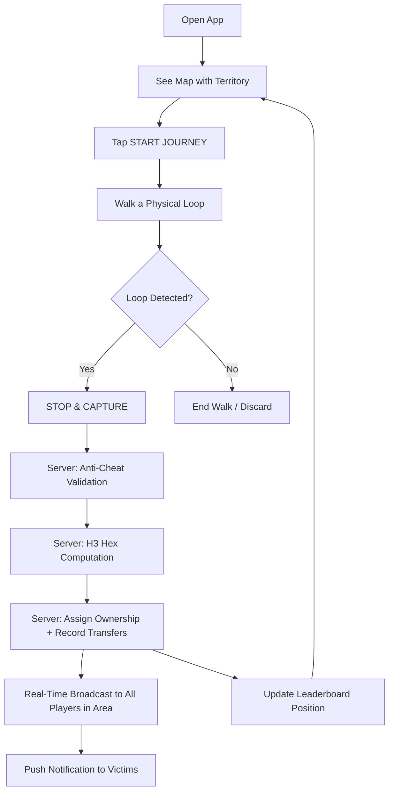
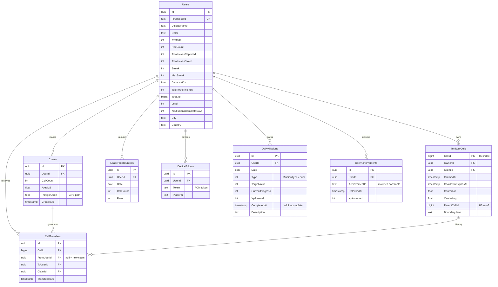
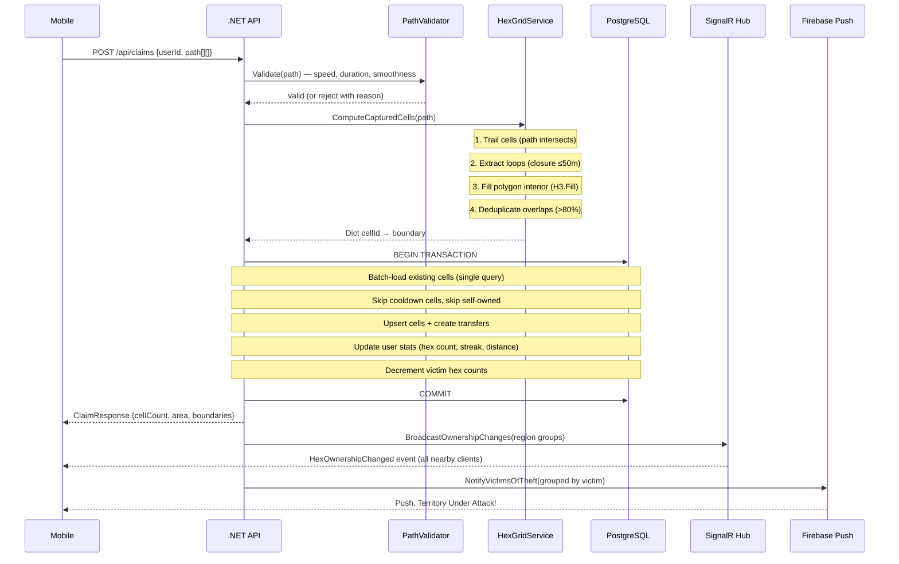

# MyLoop — Product & Technical Spec

## What Is MyLoop?

**MyLoop is a real-world territory capture game.** Players physically walk to claim hexagonal grid cells on a shared world map. Walk a loop → everything inside becomes yours. Others can steal your territory by walking through it — but you get notified and can reclaim.

Think: **Pokémon GO meets Risk meets Strava** — but instead of catching creatures or recording fitness, you're conquering and defending real geographic territory against other players in your city.

---

## Core Gameplay Loop



**What makes it addictive:**
1. You SEE territory on the map — visceral ownership
2. Others can STEAL it — creates urgency to defend
3. Daily streaks + leaderboard rank — competitive drive
4. Physical activity required — can't cheat from couch (anti-cheat enforced)
5. Local competition — city-level leaderboards make it personal

---

## Feature Inventory

### 1. Territory Capture (Core)
- Walk physically. GPS tracks your path at 5-second intervals.
- Close a loop (path endpoints within 50m) → all hexes inside the polygon are captured
- Trail cells (hexes you walk through) are always claimed regardless of loop
- Loop interior fill: closed polygon → H3 fill algorithm claims all hexes inside
- **Min walk: 200m.** Max area per claim: 5 km². Max 20 claims/day.
- 5-hour cooldown on captured cells (anti-grief: prevents instant re-steal)
- Last-writer-wins conflict model (physical presence = ownership)
- Stolen hexes logged for revenge tracking (who took what, when)

### 2. Real-Time Territory Updates (SignalR)
- WebSocket connection to backend hub
- Players auto-subscribe to geographic regions (H3 resolution-3 parent cells, ~12km zones)
- When anyone claims territory nearby, your map updates instantly
- Reconnection logic with automatic re-subscription
- Region subscription updates dynamically as you pan the map

### 3. Anti-Cheat System (3-Layer Server Validation)
- **Speed check**: Consecutive GPS points must be physically walkable (≤30 km/h, ≤60m per 5s interval). Allows 5% violations for GPS drift.
- **Duration check**: Path must have ≥50% of expected GPS samples for the distance walked
- **Smoothness check**: Bearing standard deviation must be >2°. Real GPS has natural jitter; spoofed linear paths are suspiciously smooth.
- Rejects GPS spoofers, car drivers disguised as walkers, teleportation hacks

### 4. Push Notifications (Territory Theft Alerts)
- Firebase Cloud Messaging (FCM) on iOS + Android
- Triggered when another player steals your hexes
- Message: "Territory Under Attack! ⚔️ — {PlayerName} captured {N} of your hexes!"
- Creates urgency to defend → drives re-engagement

### 5. Leaderboard System
- **Scopes**: City / Country / World
- Daily refresh: ranks all players by owned hex count
- Top 20 displayed + your own rank always visible
- Achievement counters increment on rank thresholds (top 3/10/100/1000)
- 7-day history retention for trend analysis

### 6. Progression System (Daily Missions + XP/Levels + Achievements)

**XP & Levels:**
- XP earned from: hex capture (10), hex steal (25), per km (50), streak bonus (20), all-missions bonus (100), individual mission completion, achievement unlocks (25–1000)
- Level formula: `(n-1)² × 100` XP per level. Level 10 = 8,100 XP. Level 50 = 240,100 XP.
- Level displayed in UI, used for achievement thresholds

**Daily Missions (3 per day, adaptive):**
- Generated per user per day using deterministic seed (same missions on reload)
- 6 types: CaptureHexes, WalkDistance, StealHex, ExploreNewArea, MaintainStreak, CaptureInOneWalk
- Adaptive difficulty: Player tier (Newcomer/Regular/Veteran/Elite) × behavior weights → weighted selection
- All-missions bonus: 100 XP when all 3 complete in one day
- Progress tracked in real-time during walks

**Achievements (30 permanent badges, 7 categories):**
- Capture (7): 1→5000 hexes captured
- Streak (6): 3→100 consecutive days
- Distance (5): 1→500 km walked
- PvP (4): 1→100 hexes stolen from others
- Level (4): Level 5/10/25/50
- Leaderboard (2): 1/10 top-3 finishes
- Missions (3): 7/30/100 all-missions-complete days
- Unlocked permanently, award XP (25–1000), shown as badges on profile
- Convergence loop handles cascading unlocks (achievement XP → level → level achievement)

**Architecture:**
- Single-save-point pattern: missions + achievements + XP all saved in one `SaveChangesAsync`
- Concurrent-safe: `DbUpdateException` caught at save point, conflicting achievement inserts detached
- Denormalized counters: `TotalHexesStolen`, `AllMissionsCompleteDays` on User entity
- Checked on every hex capture (negligible perf: 30 int comparisons)

### 7. Revenge System
- See who stole your hexes (last 30 days)
- Grouped by attacker — "Player X stole 47 hexes from you"
- Navigate back to stolen locations and reclaim
- 7-day revenge window for priority recapture

### 8. Walk History
- Paginated list of all past claims
- Shows: cell count, area captured, date
- Infinite scroll with lazy loading

### 9. User Profiles
- Emoji-based avatar system (50+ avatars)
- 8 territory colors (player's hexes render in their color)
- Public profile viewable from leaderboard (stats, rank, title, tier badge)
- Account deletion (GDPR compliance)

### 10. Map Visualization
- **Dual themes**: Satellite (ESRI World Imagery) + Dark (CartoDB)
- **Hex rendering**: User hexes at 20% opacity fill + solid border, other players' hexes colored by owner
- **Tap-to-inspect**: Tap any hex → see owner, claim date, ownership history
- **Follow mode**: Auto-center on GPS, toggle with re-center button
- **Wide-area preload**: Load all user hexes + ~1km viewport on app open
- **Active walk trail**: Green polyline showing current GPS path

### 11. Bot Territory System (Cold Start)
- Pre-populated territory in major cities (Bangalore, Mumbai, Delhi, London, NYC, Tokyo)
- 10 bot players with realistic hex clusters (~200 hexes each)
- Creates immediate competition for day-1 players in supported cities
- Bots have varied stats, colors, and territory sizes

---

## Technical Architecture

### Stack

| Layer | Technology | Why |
|-------|-----------|-----|
| Mobile | Flutter 3.44 / Dart 3.12 | Single codebase for iOS + Android. Fast iteration. |
| Backend | .NET 10 (ASP.NET Core) | High-performance, SignalR built-in, EF Core for DB. |
| Database | PostgreSQL 18 | GiST spatial indexes, reliable, free. |
| Spatial Grid | H3 (Uber) via pocketken.H3 | Global hexagonal grid. Hierarchical (res 3→11). Consistent cell sizes worldwide. |
| Real-Time | SignalR (WebSocket) | Built into ASP.NET, auto-fallback to long-polling, group-based broadcast. |
| Auth | Firebase Authentication | Free, handles Google/Apple OAuth, JWT tokens. |
| Push | Firebase Cloud Messaging | Cross-platform, free tier covers millions of messages. |
| Map Tiles | ESRI + CartoDB (free) | No API key, no billing, unlimited tiles. |
| State Mgmt | Riverpod 3.x | Modern Flutter state. Compile-safe. Reactive. |
| Navigation | go_router + ShellRoute | URL-based, tab persistence via IndexedStack. |
| Dev Tunnel | ngrok | Mobile testing without same-WiFi. Instant HTTPS. |

### Backend Architecture (SOLID)

```
Controllers (thin) → Services (business logic) → EF Core (data access)
         ↑                    ↑                         ↑
   Input validation    Interface-backed         PostgreSQL
   Route → Service     Constructor-injected     GiST spatial index
   ≤20 lines          ≤40 lines per method
```

**Services**:
- `TerritoryService` — Claim processing pipeline (validate → compute → assign → broadcast)
- `HexGridService` — H3 computation (point-to-cell, loop extraction, polygon fill, boundaries)
- `PathValidationService` — Anti-cheat (speed, duration, smoothness checks)
- `TerritoryNotifier` — SignalR broadcast to region groups
- `PushNotificationService` — FCM push to victims
- `UserService` — Registration, profile CRUD, account deletion
- `LeaderboardService` — Daily rank computation, scoped queries
- `GeoService` — Haversine distance, bearing calculations
- `ValidationService` — Input sanitization

### Database Schema



### Communication Patterns

| Pattern | Technology | Data Flow | Use Case |
|---------|-----------|-----------|----------|
| **Request/Response** | HTTP REST (Dio + ASP.NET) | Mobile → API → DB → Mobile | Claims, viewport queries, profiles, leaderboard |
| **Real-Time Push** | SignalR WebSocket | Server → Subscribed Clients | Territory ownership changes (instant map updates) |
| **Background Push** | Firebase Cloud Messaging | Server → FCM → Device OS → App | "Your hex was stolen" notifications (even when app closed) |
| **Auth Token** | Firebase JWT | Mobile → Firebase → JWT → API (Bearer header) | Every authenticated API call (auto-refresh every hour) |
| **Geo Subscription** | SignalR Groups | Client joins H3 parent cell groups | Only receive broadcasts for your visible map area |

### Algorithm Deep-Dive: Claim Processing



### H3 Hexagonal Grid System

**Why H3?**
- Uniform hexagons worldwide (unlike lat/lng grid which distorts at poles)
- Hierarchical: res-11 cells (25m edge) nest into res-3 parents (~12km zones)
- Polygon fill: given any closed shape, H3 returns all hexes inside it
- Deduplication: each hex has ONE globally unique ID — no overlap ambiguity
- Spatial grouping: parent cells naturally partition the world into SignalR broadcast zones

**Resolution 11 choice:**
- Edge length: ~25-29m
- Area per cell: ~2,150 m²
- Feels earnable: a typical city block walk captures 20-50 hexes
- Not too granular (res 12+ would require excessive walking for visible territory)

### GPS & Location Strategy

- **Tracking only during active capture** — battery-friendly, privacy-respecting
- **5-second sampling interval** — enough resolution for path shape, not excessive data
- **Accuracy filter**: Reject readings with accuracy > 25m
- **Speed-aware noise floor**: Stationary = 10-25m clamp, moving = 6-20m clamp
- **Distance filter**: Only record if displacement > 10m (prevent GPS drift accumulation)
- **"When In Use" permission only** — required for Apple App Store approval

---

## Game Constants

| Parameter | Value | Rationale |
|-----------|-------|-----------|
| H3 Resolution | 11 | ~25m edge. Walkable, visible, not too granular. |
| H3 Parent Resolution | 3 | ~12km zones. Good SignalR broadcast scope. |
| Min GPS Points | 10 | Path must have substance |
| Min Walk Distance | 200m | Prevents trivial tap-and-claim abuse |
| Max Claim Area | 5 km² | Prevents city-wide single-claim exploits |
| Max Claims/Day | 20 | Fair daily cap |
| Cell Cooldown | 5 hours | Anti-grief window |
| Loop Closure Distance | 50m | How close endpoints must be to detect a loop |
| Min Loop Points | 20 | Loop must represent real walking |
| Min Fill Area | 5,000 m² | Ignore tiny interior loops |
| Overlap Dedup Threshold | 80% | Skip near-duplicate polygons |
| Max Speed (Anti-Cheat) | 30 km/h (8.33 m/s) | Walking/jogging speed ceiling |
| Speed Violation Tolerance | 5% | Allow GPS jumps |
| Bearing StdDev Minimum | 2° | Catch linear spoofed paths |
| Max Viewport Cells | 500 | API response size cap |
| Max User Territory Cells | 2,000 | Per-user query limit |
| Leaderboard Top Count | 20 | Visible ranks |
| Revenge Window | 7 days | Time to reclaim stolen hexes |
| XP per Hex Captured | 10 | Base reward for walking |
| XP per Hex Stolen | 25 | Higher reward for PvP |
| XP per km Walked | 50 | Rewards distance |
| XP Streak Bonus | 20 | Daily streak incentive |
| XP All Missions Bonus | 100 | Complete all 3 daily missions |
| Missions per Day | 3 | Manageable daily target |
| Level Formula | (n-1)² × 100 | Quadratic scaling |

---

## Security Model

| Threat | Mitigation |
|--------|-----------|
| GPS spoofing | 3-layer anti-cheat (speed + duration + smoothness) |
| Token forgery | Firebase JWT validation (RSA signature + issuer/audience) |
| Rate abuse | 20 claims/day + API-level rate limiting |
| Injection | Parameterized EF Core queries only. No raw SQL. Input validation at boundaries. |
| Unauthorized access | JWT [Authorize] on all mutation endpoints |
| Account deletion | Full GDPR-compliant cascade delete (user + cells + claims + transfers + tokens) |
| Data in transit | HTTPS enforced (ngrok/production TLS) |
| Cooldown bypass | Server-enforced cooldown check. Client cannot override. |

---

## External Services & Costs

| Service | Monthly Cost | Scale Limit | Alternative at Scale |
|---------|-------------|-------------|---------------------|
| Firebase Auth | $0 | Unlimited users | Keep forever |
| Firebase Messaging | $0 | ~1M messages/month | Keep forever |
| PostgreSQL (self-hosted) | $0 | Single machine | Managed (Neon, Supabase, RDS) |
| ESRI Tiles | $0 | Unlimited non-commercial | Mapbox/MapTiler for commercial |
| CartoDB Tiles | $0 | Unlimited | Self-host OpenMapTiles |
| ngrok (dev) | $0 | 1 tunnel, rate limited | Cloud hosting (Railway, Fly.io) |
| GitHub | $0 | Unlimited private | Keep forever |
| **Total** | **$0** | — | — |

**Production hosting estimate**: Railway/Fly.io ($5-25/month) + managed Postgres ($10-50/month) = **$15-75/month** for first 10K users.

---

## API Surface

### Territory (`/api/territories`)
| Method | Endpoint | Purpose |
|--------|----------|---------|
| GET | `/api/territories?minLat&minLng&maxLat&maxLng` | Viewport hex query (max 500) |
| GET | `/api/territories/stats/{userId}` | User's cell count + area |
| GET | `/api/territories/stolen/{userId}?days=7` | Hexes stolen from user |
| GET | `/api/territories/history/{cellId}` | Full ownership history of a hex |
| GET | `/api/territories/user/{userId}` | ALL user's hexes (no viewport limit) |
| GET | `/api/territories/claims/{userId}` | User's walk/claim history |

### Claims (`/api/claims`)
| Method | Endpoint | Purpose |
|--------|----------|---------|
| POST | `/api/claims` | Submit territory claim (GPS path) |
| POST | `/api/claims/preview` | Preview which hexes path would capture (no DB write) |

### Users (`/api/users`)
| Method | Endpoint | Purpose |
|--------|----------|---------|
| POST | `/api/users/register` | Create account (post-Firebase-auth) |
| GET | `/api/users/{id}` | Get user by ID |
| GET | `/api/users/by-uid/{firebaseUid}` | Lookup by Firebase UID |
| PATCH | `/api/users/{id}` | Update profile (name, avatar, color) |
| GET | `/api/users/{id}/profile` | Rich public profile + rank |
| DELETE | `/api/users/{id}` | Delete account + all data |
| POST | `/api/users/{id}/device-token` | Register FCM push token |
| GET | `/api/users/{id}/claims?page&pageSize` | Paginated claim history |

### Leaderboard (`/api/leaderboard`)
| Method | Endpoint | Purpose |
|--------|----------|---------|
| GET | `/api/leaderboard?lat&lng&userId&scope` | Get ranked players (city/country/world) |
| POST | `/api/leaderboard/refresh` | Recompute daily rankings |

### Missions (`/api/missions`)
| Method | Endpoint | Purpose |
|--------|----------|---------|
| GET | `/api/missions/{userId}` | Get/generate today's 3 missions |
| GET | `/api/missions/xp/{userId}` | XP info (total, level, progress %) |

### Achievements (`/api/achievements`)
| Method | Endpoint | Purpose |
|--------|----------|---------|
| GET | `/api/achievements/{userId}` | All 30 achievements with progress |

---

## Implemented vs Remaining

### ✅ Fully Implemented
- Territory capture (full pipeline: GPS → anti-cheat → H3 → DB → broadcast)
- SignalR real-time updates with region-based subscription
- Anti-cheat (3-layer path validation)
- Push notifications (FCM integration, theft alerts)
- Leaderboard (city/country/world, daily refresh, achievement counters)
- User profiles (public + own, tier badges, player titles)
- Walk history (paginated)
- Bot territory seeding (6 cities)
- "End walk without capture" (just-stop feature)
- Revenge tracking (stolen hex history)
- Cell ownership history
- Account deletion (GDPR)
- Streak system
- Dual map themes
- Daily Missions (3 adaptive per day, 6 types, tier-based difficulty)
- XP & Level system (quadratic formula, multiple XP sources)
- Achievements/Badges (30 definitions, 7 categories, convergence loop, concurrent-safe)

### 🔶 Needs Work Before Launch
- Firebase project setup (GoogleService-Info.plist, google-services.json)
- Apple/Google OAuth credential configuration
- Production hosting (currently local + ngrok)
- CORS lockdown for production
- Rate limiting middleware
- FCM HTTP v1 actual sending (currently logs only)
- App Store / Play Store submission prep
- Privacy policy / Terms of Service
- Commercial map tile provider

### 💡 Future Roadmap
- Seasons (monthly competitive periods with rewards)
- Territory defense bonus (longer held = harder to steal)
- Alliance system (pool territory with friends)
- Offline mode (cache tiles + queue claims)
- Martin vector tiles (when cells exceed 5K per viewport)
- Cycling/driving modes (different speed thresholds)
- Device attestation (Play Integrity / App Attest)
- Territory cosmetics (visual effects, borders, particle systems)
- Social features (friends, messaging, challenges)

---

## Open Questions

- Monetization model: cosmetics-only (colors, avatars, effects) or functional (territory shields, cooldown extensions)?
- City zone auto-detection vs manual selection for leaderboard scope
- Escalating cooldown mechanics (reward long-held territory?)
- Season reset mechanics (full wipe vs decay vs archive?)
